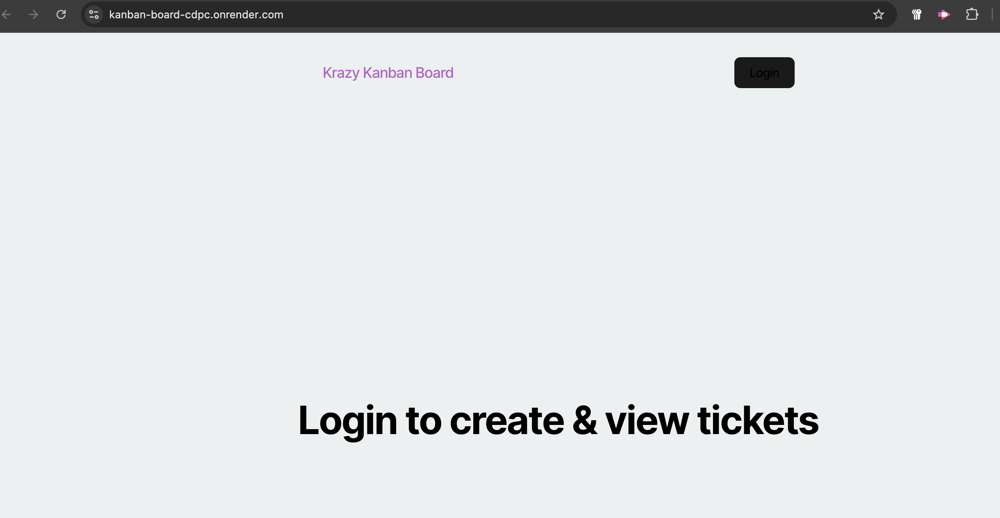

# Kanban Board

## Description
The purpose of this project was to add authentication with JWT to an existing Kanban board application. Additionally, the UI for login page was completed along with adding authentication with JWT to the server API. The application was subsequently deployed to Render.

  

## Table of Contents
- [Description](#description)
- [Technologies](#technologies)
- [License](#license)
- [Links](#links)
- [Credits](#credits)
- [Questions](#questions)

## Technologies
- PostgreSQL
- JavaScript
- TypeScript
- Node.js
- React
- JWT

## License
This project is licensed under the MIT license.

## Links
- [GitHub Repo](https://github.com/deetsb/kanban-board)
- [Render](https://kanban-board-cdpc.onrender.com)

## Credits
Tutoring sessions with Benicio Lopez and Ainsley Ellis.

## Questions
Should you have questions, please reach me via:
- GitHub: [deetsb](https://github.com/deetsb)
- E-mail: [aditya.a.bhonsle@gmail.com](mailto:aditya.a.bhonsle@gmail.com)
